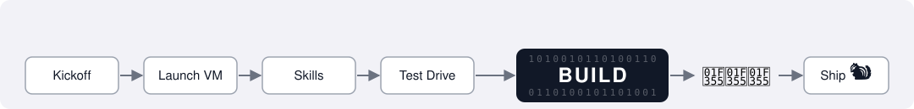
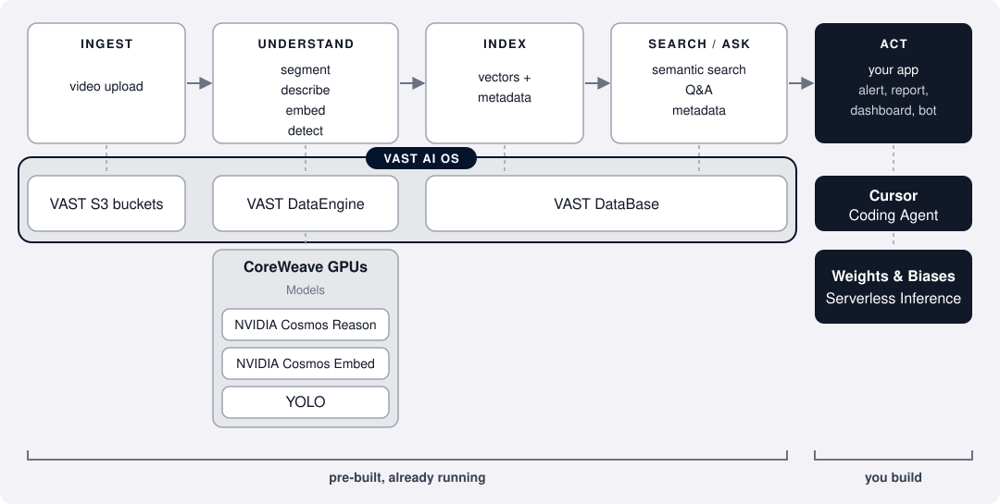
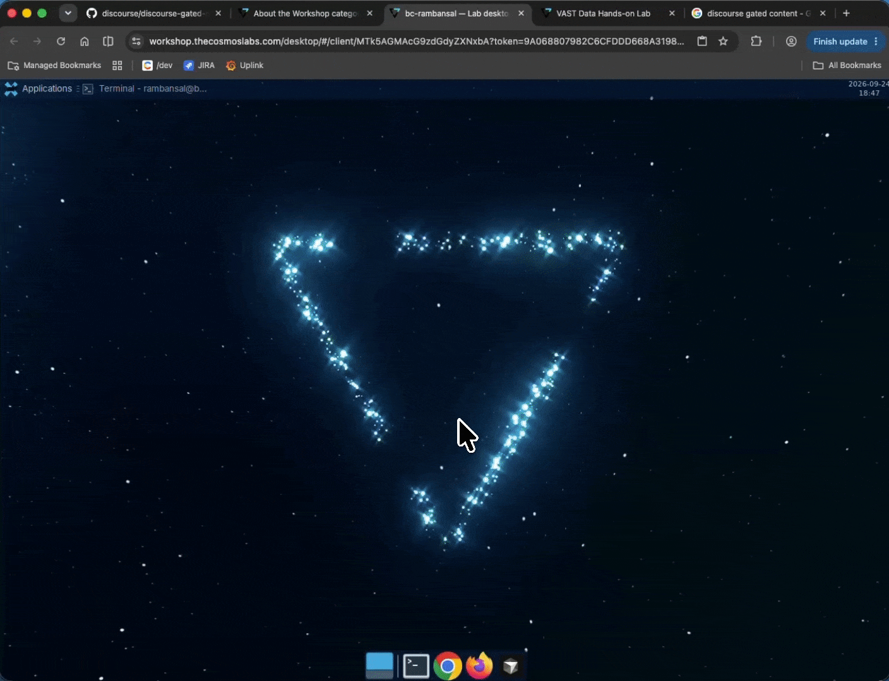
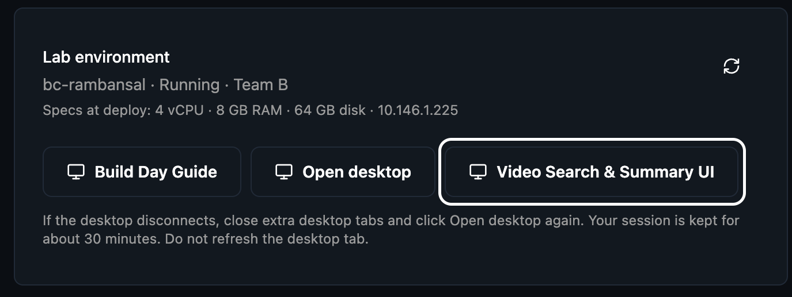

# VAST Builders Challenge: Video Agents

Spend the day building with video:

<p align="center"></p>

The infrastructure is already running, so you skip straight to the interesting part: turning hours of video into something that searches, reasons, and acts.

## 1. Kickoff

### What you're building
An app that understands video and does something with it. Search hours of
footage in plain language, ask what happened, detect and track objects, or call an action
when something matters. 

**Pick one idea and ship a working app by end of day.**

### The Builders Stack
Video runs through a pipeline that understands and indexes it:

<p align="center"></p>

Everything under "pre-built, already running" is done for you. The pipeline ingests,
understands, and indexes video, and the models it calls are already deployed and
serving. You build something cool that searches and acts.

For a deeper dive, check out the [Architecture Reference](https://github.com/relaxedtomato/vast-builders-challenge/blob/main/HACKATHON_GUIDELINES.md).

## 2. Launch VM

[Visit and join Cosmos](https://community.vastdata.com/t/about-the-workshop-category/1969?utm_campaign=event26-builders-challenge) to access the VM and ask questions! No setup. Nothing to install, no config to paste :)

> 💡 All commands run on the workshop VM via the terminal in your browser. Nothing runs on your laptop.

Wait for the VM to load. That's it. You're in!

### Your team
> ⚠️ **IMPORTANT: Ensure you select the assigned team (e.g. `team-1`) so each team members accesses the same video ingestion pipeline.**

You build as a team. Your team shares one video ingestion instance, one index, and one set of
credentials, so anything a teammate ingests shows up in every team members searches.

### Coding Agent
Describe what you want in plain language and let the code agent build. That's how the skills are meant to be used.
To get started, sign in using the Cursor IDE:

<p align="center"></p>

> 💡 If Cursor asks you to sign in, use the email you applied to the Builders Challenge. Expect one or two tries; that's normal.

Drive the day from the **Cursor Agent (CLI)**. Start the agent in the terminal:

```sh
cd ~/vast-builders-challenge    # the agent works from the current directory
agent                           # start an interactive session
```

Once it's running, set the model to Auto to save tokens:

```sh
/model                          # type `/model` to change model
 →  Auto Balance                # Select `Auto`
```

Here is a video overview of the steps from this section:

<video src="docs/videos/vm-loading-2.mp4" controls width="100%" style="width:100%;height:auto;display:block;">
  <a href="docs/videos/vm-loading-2.mp4">Watch the Launch VM walkthrough (mp4)</a>
</video></br>

> 💡 **Useful VM Keybindings.**
> - **Copy and paste.** In the terminal it's `Ctrl+Shift+C` and `Ctrl+Shift+V`
> - **Display size.** Use `Ctrl -` to zoom out and `Ctrl 0` to zoom in.


Before you kick off the coding agent and start using skills, head to the next section. We'll circle back to Skills very soon.

### If something looks off
Run the health check in the [Reference](#reference) section, then drop a question on [Cosmos](https://community.vastdata.com/t/about-the-workshop-category/1969) (include team name) and someone will reach out.

## Video Search & Summary UI
> 💡 This example app runs on the same API as the skills (`.cursor/skills`) you will be using. It's a built idea of what you can build today, and a quick way to check things out while building.

From the same page you loaded the VM, click on the the Video Search & Summary button:


Try a few of the search suggestions to see ranked clips with timestamps and the description Cosmos Reason returned for each one:


<!-- > [TODO] replace w/ giphy / video and search topic -->

Explore the three tabs:
**Search** to query videos, **Explore** to browse what's indexed, and **Dashboard** to get stats.

## 3. Skills, Skills, Skills

The skills live in `.cursor/skills/`, split into `ingest/` and `retrieval/`. Each
skill guides the coding agent: the endpoint, the request, the response, and
what to do when it fails.

Describe what you want and the coding agent loads the matching skill.

```
"ingest the warehouse video with a prompt about safety gear"
"find people near the entrance after 6pm"
"summarize what happens in the warehouse video"
```

Skills read what they need from environment variables, so nothing should ask you for a
password or a URL. If something isn't working, ask for help.

### Ingest: re-running video

> ⚠️ **IMPORTANT:** Avoid having everyone on the team ingest large chunks of video (i.e. hours of video). Designate 1-2 team members to handle kicking off majority of the ingestion. Its okay for each team member to ingest a few videos to try things out.

Your team's video is already indexed. Ingest here means running it through the pipeline
again with a different prompt, so the descriptions match what you're building.

| Skill | Use it to |
|-------|-----------|
| `reingest-videos` | Re-run a whole indexed video with a new prompt or metadata |
| `reingest-chunk` | Re-run one specific chunk, found by filename, scene, date, or camera |

**Re-ingesting takes a few minutes.** Every segment is described, embedded, and detected
again before it becomes searchable. Ask the agent to confirm before you go looking.

> 💡 **The prompt decides what gets indexed.** Cosmos Reason describes every segment
> following an ingestion prompt. Anything it doesn't ask about never gets written down, so
> you can't search for it later.
>
> On a construction site you might ask it to describe safety gear. In a public space you
> might ask to identify people with umbrellas are in frame. Search the existing index for what your idea
> needs; if it isn't there, that's what re-ingesting is for.
>
> Set the prompt with `custom_prompt`, or pick a `scenario` preset.

### Retrieval: Searching Video

| Skill | Use it to |
|-------|-----------|
| `search` | Find moments matching a description, with filters for time, location, camera, tags. |
| `agent-qa` | Ask a question and get an answer with evidence, instead of a list of hits. |
| `videos` | Browse what's indexed, play a clip, read its captions and detections, summarize a whole video. |
| `dashboard` | Check what's indexed and whether ingest is healthy. |
| `suggest-prompts` | Get generated example queries and notable recent events. |

Worth knowing: `vastdb-read` queries the database directly, for when you want to check the database contents.

## 4. Test Drive

STOPPED HERE

Before you build, run one loop by hand. It tells you the whole stack is working
and helps you understand what you can build.

### Search what's there

Your team's index already has video in it, so start by looking:

```
what's in the index? show me a few examples
```

Then search for something specific to your idea:

```
find the moment where <something you care about> happens
```

You get back ranked segments with timestamps, scores, and the description the model wrote.
Play one to confirm it's the moment you meant.

### Ask instead of search

```
what happens in <one of those videos>?
```

Same index, different kind of answer. The first hands you moments. The second reads those
moments and writes you an answer.

Do you want to show someone the clip, or tell them what happened? Most of designing a video
app is picking one.

### Find what's missing

Search for something your idea needs that the existing descriptions probably don't mention.
Counts of people. What someone is carrying. Whether a vehicle stopped.

If it comes back empty, that's not a broken search. It means the ingestion prompt never
asked about it, so nothing was written down.

### Re-ingest with your prompt

```
re-ingest <that video> with a prompt that describes <what your app needs>
```

The agent loads `reingest-videos`, shows you what it's about to re-run, and asks for the
prompt. Give it a few minutes, then run the same search again. This time it matches.

To watch progress, ask `is it done yet?` or open the Dashboard tab.


> 💡 That gap, between what you searched for and what the prompt asked about, is the thing
> to keep in mind all day. Everything you can build depends on what the descriptions say.

### That's the whole loop

Search, ask, re-ingest, search again. Everything you build today sits on those steps. If
they worked, your stack is healthy and you can start building.

If any of them didn't, run the health check in the [Reference](#reference) section.

### Recap: What you have
- A **video ingestion instance** running for your team: the pipeline ingests, understands, and indexes
  your video.
    - Cosmos Reason, Cosmos Embed, and YOLO run on CoreWeave GPUs; you
  don't call them directly, you query the vectors generated.
- A **VM with Cursor** pre-loaded, including this repo and your credentials and
  endpoints available as environment variables.
- **Serverless LLM inference** from Weights & Biases by Coreweave for your app's own logic.
- A set of **skills** that drive the pipeline in plain language. See next section on
  [Skills](#3-skills-skills-skills).

## 5. Build

### What "done" looks like
You have a working index and you know how to query it. The rest of the day is what you
build on top. A small app, agent, or a dashboard. A clear use case.

### What video you have

Your index is already full and searchable. Every folder and camera ID is in
[Video corpus](HACKATHON_GUIDELINES.md#video-corpus-already-indexed), grouped by use case in
[Use-case groups](HACKATHON_GUIDELINES.md#use-case-groups), with worked
[Example queries](HACKATHON_GUIDELINES.md#example-queries).

### The loop

1. **Pick a use case**
2. **Build an app or agent**
3. **Deploy and iterate**

If the existing captions cover what you need, you never have to think about prompts. If they
don't, ingest the footage again with a different prompt.

> 💡 **Start with a few clips.** Read the captions that come back before you ingest anything
> at volume.

### LLM access

Search and Q&A come from your VSS instance. Anything your app decides on top of that,
classifying results, drafting a summary, choosing an action, runs on serverless LLM
inference from Weights & Biases.

> [TODO] Reference or point to the actual Serverless Inference endpoint(s) here — how to
> get the URL/key from env vars, and how to point your own app's reasoning or agent at it
> if you need one.

The skills used by Cursor can be used by agent frameworks too. They follow the standard
`SKILL.md` format, so most frameworks load them straight from `.cursor/skills/`.

## Reference

### Health check

If something isn't working, pull first. The repo is pre-cloned and may be behind:

```sh
git pull
```

Then ask the agent:

```
check that everything is working: log in, and show me the dashboard
```

If it fails, tell an organizer.

### Event dashboard

Live for the event: [video-lab-event.cosmos.vastdata.com](http://video-lab-event.cosmos.vastdata.com/)

### Your team's values

Everything the skills need is already in your environment. `config.example` in this repo
lists every variable with a description.

## 6. Judging

Ask the agent to run the submission skill:

```
help me submit our project
```

It asks for your team details, drafts your project description from your code, and collects
the confirmations you need to be eligible. It writes `SUBMISSION.md` in the repo root.

> 💡 **Have these ready:** a link to your code or repo, your demo video, and an email
> address for each team member. An incomplete submission may not be judged.

**Record the demo on your own laptop, not the VM.** You're already watching the VM in a
window, so your laptop's own recorder captures it: `Cmd+Shift+5` on a Mac, `Win+G` on
Windows. Upload the file to your google drive (or equivalent) and share a link.

When `SUBMISSION.md` is ready, send your submission over.

### Demo

We'll do a first round of judging with each team to walk through what you built and to hear how the day went.

