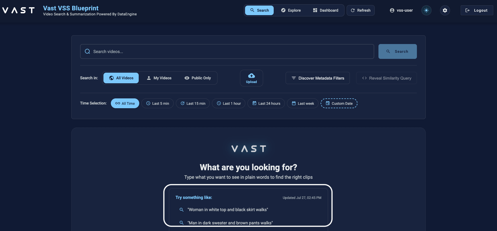
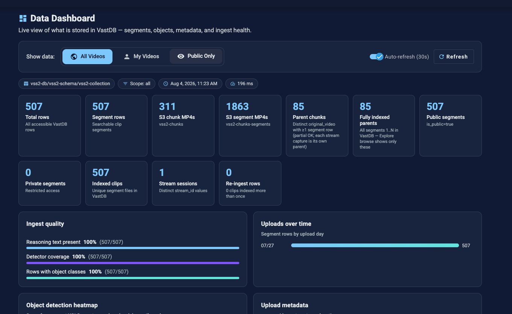

# VAST Builders Challenge

Spend the day building with video. The infrastructure is already running, so you
skip straight to the interesting part: turning hours of video into something that
searches, reasons, and acts.


---

## 1. Kickoff

### What you're building
An app that understands video and does something with it. Search hours of
footage in plain language, ask what happened, detect and track objects, or fire an action
when something matters. Pick one idea and ship a working app by end of day.

### The Tech Stack
Video runs through a pipeline that understands and indexes it.

```
  INGEST          UNDERSTAND                 INDEX          SEARCH / ASK       ACT
  video   ─▶  segment                  ─▶  vectors +  ─▶  semantic search ─▶  your app
              describe  (Cosmos Reason)    metadata       · Q&A · metadata    (alert, report,
              embed     (Cosmos Embed)                                         dashboard, bot)
              detect    (YOLO)
       └─────────────── pre-built, already running ───────────────┘      └─ you build ─┘
                                                                    (your app's reasoning: W&B)
```
<!-- IMAGE: architecture diagram, replacing the ASCII block. Alt: "Pipeline flow from
     video ingest through indexing and search to the agent you build." -->

Everything under "pre-built, already running" is done for you. The pipeline ingests,
understands, and indexes your video, and the models it calls are already deployed and
serving. You build what comes after: the app that searches the index and acts.

<!-- TODO: can we simulate ingestion for testing agents, via re-ingestion? -->

<!-- TODO: describe the VSS UI as a pre-built example, and as the way to sanity-check
     ingest and explore what's indexed. -->
<!-- TODO: confirm the UI path. The guide now says the UI is at $INGRESS_URL; check
     whether it's served at the root or on a subpath, and correct if so. -->
**The VSS search UI.** Type what you want to see in plain words and it returns matching
clips.



> 💡 The VSS search UI is an example of what you can build, already built and running. Use
> it to test the pipeline and see what's indexed while you build. Your team's UI is at
> `$INGRESS_URL`.

### What you have
- A **VSS instance** running for your team: the pipeline ingests, understands, and indexes
  your video. Cosmos Reason, Cosmos Embed, and YOLO run inside it on CoreWeave GPUs; you
  don't call them directly, you query the vectors generated.
- **Serverless LLM inference from Weights & Biases** for your agent's own logic.
- A **VM with Cursor** pre-loaded, with this repo cloned and your stack credentials and
  endpoints already set as environment variables.
- A set of **Cursor skills** that drive ingest and search in plain language.

<!-- HIDDEN for the dry run: restore the schedule before the real event.
     ### How the day runs
     | Time | What |
     |------|------|
     | 8:30 | Doors + breakfast |
     | 9:00 | Opening remarks |
     | 9:30 | Build begins |
     | 12:30 | Lunch |
     | 4:30 | Demos |
     | 6:30 | Closing + awards |
-->

### What "done" looks like
Something that runs, not slides. A small app, agent, or a dashboard. Judging rewards a
clear use case and clever use of search plus metadata over polish. Scope it small enough
to demo live.

<!-- TODO: judging criteria. Decide owner: §7 here, or the event page. Needs the rubric
     (categories, weightings, judges, demo length, is code assessed?) and a link from this
     sentence. -->


---

## 2. Launch your VM

No setup. Nothing to install, no config to paste, no keys to type.

1. Open the VM link for your team. <!-- TODO: confirm delivery channel (email / Luma / on-site card) and the one-click flow. -->
2. Wait for the VM to load.
3. If Cursor asks you to sign in, use the email you applied with. Expect one or two tries;
   that's normal.

That's it. You're in.

### Work from the agent
Drive the day from the **Cursor Agent (CLI)**. Describe what you want in plain language
and let the code agent build. That's how the skills are meant to be used.
Alternatively, you can use the IDE.

Start the agent in the terminal:

```sh
cursor-agent            # start an interactive agent session
```
<!-- TODO: confirm the Cursor Agent CLI command and flags; replace the example. -->
<!-- TODO: does signing into the Cursor IDE also authenticate the CLI agent, or is a
     separate sign-in needed? Verify with Cursor. -->

From there, describe the task and the agent picks the matching skill. Start with
[Meet your skills](#3-meet-your-skills), then ingest a clip and search it.

<!-- IMAGE: the loaded VM. Alt: "The workshop VM with Cursor open on the Builders
     Challenge repo." -->
<!-- TODO: walk through what attendees see on load. Screenshot or short clip. -->

### If something looks off
Run the health check in the Reference section to confirm each piece is reachable, then
flag an organizer if anything is red.

## 3. Meet your skills

Your starter code lives in `.cursor/skills/`, split into `ingest/` and `retrieval/`. Each
skill teaches the agent one piece of the stack: the endpoint, the request, the response, and
what to do when it fails.

Describe what you want and the agent loads the matching skill.

```
"upload the clips in ~/samples and tell me when they're searchable"
"find people near the entrance after 6pm"
"summarize what happens in the warehouse video"
```

Skills read what they need from environment variables, so nothing should ask you for a
password or a URL. If something isn't working, ask for help.

### Ingest: Adding Video

| Skill | Use it to |
|-------|-----------|
| `upload-videos` | Upload video files from disk. Handles the chunking rules and reports what indexed. |
| `stream-capture` | Capture from a live RTSP or HTTP stream into the pipeline. |

Both land video in the same place and the pipeline takes over. Two things that catch
people out:

**Video is ingested in ~30 second chunks**, not whole files. The skill splits long files
locally with ffmpeg, then uploads each chunk.

**Indexing takes a few minutes.** Upload succeeding means the file landed, not that it's
searchable. Ask the agent to confirm before you go looking for it.

<!-- TODO: move these prompt warnings into the skills themselves. A warning in the guide
     only works if someone read the guide; the same words inside `upload-videos` and
     `stream-capture` reach the attendee at the moment they ingest, which is when it matters.
     Applies to all three prompt callouts (sections 3, 4, 5). Keep a short version here and
     let the skill carry the detail. -->
> 💡 **Your prompt decides what gets indexed.** Cosmos Reason captions every segment using
> an ingestion prompt. Anything it doesn't ask about never gets described, so you can't
> search for it later.
>
> Pick your prompt before ingesting at volume. On a construction site you might ask it to
> describe safety gear. In a public space you might ask how many people are in frame.
> Ingest everything with the safety prompt, then switch to building the crowd monitor, and
> your searches come back empty. **Fixing that means ingesting it all over again.**
>
> Set the prompt per upload with `custom_prompt` (800 characters max), or pick a `scenario`
> preset.

<!-- TODO: paste the default ingestion prompt verbatim, from the pipeline config /
     VDB_PROMPTS_COLLECTION. -->
<!-- TODO: list the `scenario` presets and what each asks for, plus a stable reference
     for `custom_prompt`. -->
<!-- TODO: net-new `reingest` skill. Re-run captioning/embedding with a different prompt,
     without re-uploading. Open: granularity (segment / filtered set / whole video); the
     writer skips duplicate `source`, so overwrite or version? (`dashboard` already reports
     `re_ingest_rows`, find out what that does first); cost cap on shared Cosmos endpoints.
     Covers the §1 re-ingestion note too. -->
<!-- TODO: can a team change the pipeline DEFAULT prompt, or only override per upload? If
     editable, that's a missing skill and the advice above changes. -->

### Retrieval: Searching Video

| Skill | Use it to |
|-------|-----------|
| `search` | Find moments matching a description, with filters for time, location, camera, tags. |
| `agent-qa` | Ask a question and get an answer with evidence, instead of a list of hits. |
| `videos` | Browse what's indexed, play a clip, read its captions and detections, summarize a whole video. |
| `dashboard` | Check what's indexed and whether ingest is healthy. |
| `suggest-prompts` | Get generated example queries and notable recent events. |

Worth knowing: `vastdb-read` queries the database directly, for when you don't
believe what the API is telling you.

<!-- TODO: replace both tables with a pointer to the overview skill (/pipeline-skills-101)
     once it exists. See DECISIONS.md "Parked". -->
<!-- TODO: add `cosmos` to the tables once written. `submission` exists but is covered in
     section 7, so decide whether it also needs a row here. -->


## 4. Ingest and search

Before you build anything, put one video through the pipeline. This tells you the whole
stack is working.

Your team's index already has video in it, so search works from the start. This section is
about the other half: watching footage go in.

### Ingest a clip

<!-- TODO: write the bring-your-own-footage rules. Attendees will upload phone video,
     doorbell clips, and footage from work. Needs a plain disclaimer covering:
       - only upload footage you have the rights to use
       - no identifiable people without consent; nothing confidential from an employer
       - uploads land in the shared TEAM bucket and index, visible to teammates, not private
       - what happens to it after: environment destroyed, but say so explicitly
       - three jurisdictions: London is UK GDPR, SF and NYC are not
     Needs legal review; do not ship Claude's wording. Related: any footage sourced from a
     third party (transit agency, archive) may be licensed for hosted VMs only, which is a
     different rule than for attendees' own clips. -->

There are sample clips in `~/samples/` that are deliberately not indexed yet. Ask for one:

```
upload ~/samples/<clip>.mp4 and tell me when it's searchable
```

The agent loads `upload-videos`, splits the file into ~30 second chunks, uploads each one,
and reports what landed. Uploading takes seconds. Indexing takes a few minutes, because
every segment gets captioned, described, and embedded before it can be found.

### Try your own prompt

That upload used the default ingestion prompt. Run the same clip again with your own:

```
upload ~/samples/<clip>.mp4 again, with a prompt that describes <what your agent needs>
```

The agent passes it as `custom_prompt`. Once both are indexed, search for something only
your prompt asked about. The first copy won't match, because its captions never mention it.

> 💡 **Pick your prompt before you ingest anything at volume.**

This applies to the video already in your index. It was all ingested with the default
prompt, so anything that prompt didn't ask about isn't searchable. Your own uploads are the
only footage whose prompt you control.

<!-- TODO: link the prompts used to ingest the existing corpus, so attendees can see what
     the pre-built index can actually answer before choosing a project. Options: point at
     $VDB_PROMPTS_COLLECTION and let a skill read them, or paste them into the Reference
     section. Preference: readable in the guide AND queryable, since a team that picks an
     idea the default prompt never described has to re-ingest or change the idea. -->

### Confirm it indexed

```
is my video indexed yet?
```

**The VSS UI dashboard tells you whether your video is ready.** Your upload is searchable
once it shows up as a fully indexed parent and the segment count stops climbing.



Wait for it to say your video is fully indexed. Searching before then returns nothing, which
looks like a broken search.

### Search for it

Ask for something you know is in the clip:

```
find the moment where <something you saw> happens
```

You get back ranked segments with timestamps, similarity scores, and the caption the model
wrote. Play one to confirm it's the moment you meant.

Then ask a question instead of searching:

```
what happens in the video I just uploaded?
```

Same index, different kind of answer. The first hands you moments. The second reads those
moments and writes you an answer.

Do you want to show someone the clip, or tell them what happened? Most of designing a video
agent is picking one.

### That's the whole loop

Ingest, index, search, ask. Everything you build today sits on those four steps. If all
four worked, your stack is healthy and you can start building.

If any of them didn't, run the health check in the Reference section.


## 5. Build

You have a working index and you know how to query it. The rest of the day is what you
build on top.

### What video you have

<!-- TODO: PLACEHOLDER. The actual sources are not known yet. Describe each one attendees
     can use, and for each: what it is, whether it is already ingested, and whether they
     control the prompt.
     Candidates so far, all unconfirmed:
       - the pre-built team index (subject, setting, hours, camera count, overlapping views,
         audio, time period) - this is the one teams pick a use case from, so it matters most
       - sample clips staged in the VM, deliberately not pre-ingested
       - a live RTSP feed at $RTSP_URL, optional per city
       - attendees' own footage, subject to the bring-your-own rules in section 4
     Confirm which of these exist per city, and note any licence limits on third-party
     footage. -->

### The loop

1. **Pick a use case**
2. **Build an app or agent**
3. **Deploy and iterate**

If the existing captions cover what you need, you never have to think about prompts. If they
don't, ingest the footage again with a different prompt.

> 💡 **Start with a few clips.** Read the captions that come back before you ingest anything
> at volume.

<!-- TODO: say what footage is actually available. Attendees need to know before picking a
     use case: what's already indexed (source, subject, hours, how many cameras), what's
     staged in ~/samples/, the RTSP feed, and whether they may bring their own. Any footage
     from a third party may carry licence terms that limit what attendees can do with it, so
     state those limits here rather than leaving people to guess. -->

### Using the skills outside Cursor

The skills are plain markdown, so they aren't limited to Cursor. If you build on your own
agent framework, read the frontmatter descriptions, pick the one that matches the request,
and put its body in the prompt. That's all Cursor is doing.

Two things to know. The skills are instructions, not tools, so your agent still needs a way
to make HTTP calls. And a smaller model will follow a multi-step skill less reliably than
the one in Cursor, so expect to do more of the orchestration yourself.

### LLM access

Search and Q&A come from your VSS instance. Anything your agent decides on top of that,
classifying results, drafting a summary, choosing an action, runs on serverless LLM
inference from Weights & Biases.

<!-- TODO: restore this line once the script exists:
     Run [`examples/wandb-inference.py`](./examples/wandb-inference.py) to check it works
     before wiring it into your agent. -->

<!-- TODO: examples/wandb-inference.py DOES NOT EXIST YET. The link above is dead until it
     is written. Script should read WANDB_API_KEY / WANDB_TEAM / WANDB_PROJECT from the
     environment, make one call, print the response, and exit non-zero with a clear message
     if inference is unreachable.
     Blocked on: which model is available, and whether the OpenAI-compatible path or the W&B
     SDK is recommended. Also confirm examples/ is where we want it. -->

<!-- TODO: use-case sparks. 4-6 concrete ideas grounded in the footage teams actually have,
     plus a link to the Request for Builds doc. Teams re-decide scope on the morning
     regardless of what they read beforehand, so this needs to be skimmable. -->

## 6. Reference

### Health check

If something isn't working, ask the agent first:

```
check that everything is working: log in, and show me the dashboard
```

If it fails, tell an organizer.

<!-- HIDDEN until we have the details: restore this before the event.

     ### Getting help

     Needs: which organizers to find and where they sit, the event Slack channel name and
     join link, and the `cosmos` skill once it exists (ask a question without leaving the
     agent). Also decide whether questions go to Slack or to a person first. -->

### Your team's values

Everything the skills need is already in your environment. `config.example` in this repo
lists every variable with a description.

## 7. Submit and demo

Ask the agent to run the submission skill:

```
help me submit our project
```

It asks for your team details, drafts your project description from your code, and collects
the confirmations you need to be eligible. It writes `SUBMISSION.md` in the repo root.

> 💡 **Have these ready:** a link to your code, a link to your demo video, and an email
> address for each team member. An incomplete submission may not be judged.

When `SUBMISSION.md` is ready, copy its contents into the event Slack channel.

<!-- TODO: name the Slack channel and add a join link. Pasting contents is the dry-run
     approach; revisit for the real events, where a form may be needed and where pasting
     member email addresses into a shared channel is worth a second look. -->

### Demo

We'll book a time with each team to walk through what you built and to hear how the day
went.

<!-- HIDDEN for the dry run: restore before the real event.

     Needs: demo logistics (length is five minutes, running order, what should be on screen,
     whether slides are allowed, who presents), and the judging criteria, which is the same
     open question as the TODO in section 1: publish the rubric here or link the event page.
-->
